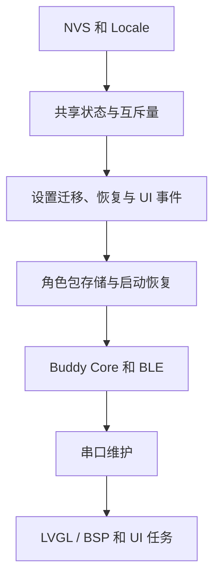

# 开发文档

本文介绍固件架构、共享状态与锁、设置和存储、UI、BLE 接口、构建与固件打包。硬件接线、首次构建和 VS Code 配置见 [README](README.md)，Agent 开发说明见 [AGENTS.md](AGENTS.md)。

## 目录

- [当前技术配置](#当前技术配置)
- [目录职责](#目录职责)
- [启动流程](#启动流程)
- [状态与并发](#状态与并发)
- [应用模型](#应用模型)
- [设置与持久化](#设置与持久化)
- [字体与资源](#字体与资源)
- [UI 布局与交互](#ui-布局与交互)
- [BLE 校时协议](#ble-校时协议)
- [角色包 V2 接口](#角色包-v2-接口)
- [构建](#构建)
- [调试与维护](#调试与维护)
- [固件打包](#固件打包)

## 当前技术配置

| 项目 | 当前值 |
|---|---|
| 产品版本 | `0.5.0-rc.1`，由顶层 `CMakeLists.txt` 显式指定 |
| 芯片 | ESP32-S3 N16R8 |
| SDK | ESP-IDF 6.0.2 |
| 实时操作系统（RTOS） | FreeRTOS，系统节拍为 1000 Hz |
| 图形界面（UI） | LVGL 9.x、Espressif `esp_lvgl_adapter` |
| LCD | ESP-IDF `esp_lcd` ST7789 驱动 |
| 触摸 | `atanisoft/esp_lcd_touch_xpt2046` 1.0.6 |
| 文件系统 | Flash 上的 FATFS，挂载路径为 `/spiffs`；镜像由 `storage/` 生成 |
| 更新方式 | USB／串口烧录 |

具体组件版本以 `dependencies.lock` 和 `main/idf_component.yml` 为准。

## 目录职责

| 路径 | 职责 |
|---|---|
| `main/app_main.c` | 启动顺序，以及决定哪些服务必须启动、哪些服务失败后仍可继续运行 |
| `main/app_shared.h` | `buddy_app_t`、快照、事件、功能可用标志位和跨模块接口 |
| `main/app_ui_events.c` | UI 待刷新标志、不允许丢失的 Prompt 回复和 Activity 通知 |
| `main/app_ui_snapshot.c` | UI 只读快照 |
| `main/ui.c` | 对外 UI 初始化与启动入口，转发到 `ui_core` |
| `main/ui/ui_core.*` | 显示启动、UI Task、快照刷新调度、导航应用、旋转、AOD 和审批覆盖层协调 |
| `main/ui/` | 导航、布局、状态栏、各页面、审批和息屏显示；各模块管理自身的 LVGL 对象 |
| `main/ui_app_registry.*` | Buddy 和 Diagnostics 的编译期描述符和能力判断 |
| `main/ui_locale.*` | `zh_CN` / `en_US`、文本表、动态字体和 Locale 持久化 |
| `main/app_settings.c` | 设置 schema 3、校验、延迟保存、旧数据清理与恢复默认 |
| `components/buddy_bsp/` | LCD、触摸、背光、旋转、触控校准和状态灯 |
| `components/esp_desktop_buddy*` | Buddy 协议、BLE 传输和角色包推送 |
| `storage/` | 动态字体和 storage 可烧录文件的输入 |
| `tools/ui_preview/` | Vue 界面与状态预览工具 |

## 启动流程



配置保存在非易失存储（NVS）中。启动依次初始化配置、角色包存储、Buddy Core、BLE、串口和显示／触摸。storage 挂载失败时保留数据并提供串口诊断；NVS 初始化失败时报告错误并停止启动。

### 显示、触摸与任务分配

ST7789V 使用 80 MHz SPI 时钟和深度为 2 的传输队列。LVGL 绘制到单个 16 行、7680 B 的内部 RAM 缓冲，通过直接内存访问（DMA）提交到显示屏。像素格式为 `LV_COLOR_FORMAT_RGB565_SWAPPED`，缓冲中的字节序与面板一致。刷新调度周期为 33 ms；30 FPS 是设计目标，实际帧率受动画、页面内容和总线负载影响。

XPT2046 的低有效中断 `T_IRQ` 接 GPIO16。中断唤醒触摸任务后，任务采样并更新触摸快照，LVGL 读取快照。显示 DMA 传输和触摸采样共用 SPI2，通过同一个二值信号量协调总线访问。80 MHz 的显示通信对接线长度和信号质量有要求，花屏、闪屏及触摸稳定性需要在实际接线下验证。

`CONFIG_BUDDY_LVGL_CORE` 可选 Core 0／1，ESP32-S3 默认 Core 1。LVGL 工作任务、软件绘制线程、UI 和 SPI2 相关任务使用该设置；`buddy_core`、`buddy_nus_tx`、`console_repl` 与 NimBLE 协议栈运行在 Core 0。固定的 LVGL 与 adapter 源码通过 Component Manager 的 `override_path` 接入，版本和本地修改见 [组件说明](components/third_party/README.md)。

LVGL 对象、字符串和软件绘制临时数据由 `main/ui/ui_memory.c` 固定从 PSRAM 分配，耗尽时正常报告分配失败。显示适配器（adapter）独立申请内部 DMA 绘制缓冲。`lv_mem_monitor` 统计整个共享 PSRAM 堆，并非 LVGL 独占用量。启动背光保持关闭，UI 任务完成首次刷新后恢复设置亮度。

UI 任务收到刷新通知时读取快照，并按 1 Hz 检查时钟。文本或数据变化时只更新对应控件，减少全屏重绘。

显示或 LVGL 初始化失败时无法提供触摸界面。Buddy、BLE 或角色包服务失败时，能力标志和诊断信息记录对应错误；storage 挂载失败时保留原数据。

## 状态与并发

`buddy_app_t` 保存应用共享状态。服务更新各自负责的字段，UI 读取快照后显示。

- 跨任务读写 `buddy_app_t` 必须持有 `app->mutex`，除非字段旁明确注明允许无锁访问及其条件。
- 服务只写自己负责的字段。
- 服务任务不得调用 LVGL。
- UI 通过 `buddy_app_ui_snapshot_get()` 获取快照。该接口等待 `app->mutex` 最多 20 ms，失败时保留上一帧快照。
- LVGL 对象只能由 UI 任务在 LVGL adapter lock 内访问。
- 持有 `app->mutex` 时不得调用可能同步派发 LVGL 事件的控件设置接口。

服务更新状态后调用 `buddy_app_ui_notify()`，UI 按以下标志合并刷新请求：

```text
BUDDY / TIME / SETTINGS / LAYOUT / ACTIVITY
```

Prompt 回复必须逐条传递且不能丢失，不能用“只保留最新值”的状态更新方式代替。Activity 是 32 条 RAM 环形记录，重启后清空，且不得记录密码、API key、配对码或完整敏感 Prompt。

### Buddy 状态快照

电脑与设备通过逐行 JSON（JSONL）传递 Buddy 状态快照。每条消息以换行结束，包含当前会话和审批状态。

- V1 电脑端（Host）状态快照必填 `total`、`running`、`waiting`、`msg`、`tokens` 和 `tokens_today`。`tokens_today` 为 V1 协议字段，不参与当前界面显示。
- `entries` 与 `prompt` 可选；完整快照缺少 `prompt` 表示清除当前审批。
- `prompt.id` 最多 40 UTF-8 字节且不得截断；`tool`、`hint` 分别最多保存 20、1024 UTF-8 字节，均不含结尾 NUL。设备收到超限 `hint` 时在 UTF-8 字符边界截断，并在审批卡片固定显示“说明未完整显示”。若发送端先将更长的原文截到 1024 字节以内，必须在这 1024 字节内附上“说明未完整显示”等可见标记；设备无法从已截短的文本反推出原文长度。
- 单行 JSON 最大 4096 个传输字节，不含末尾换行；JSON 转义和其他状态字段同样占用此预算。超长行和格式错误的 JSON 记录协议错误并丢弃，不覆盖上一份有效快照。BLE 单次写入最大 512 字节，可分片发送同一行。`protocol: 2` 快照仍使用 `prompt` 请求与 `permission` 回复。
- 未知字段安全忽略。仅 `protocol == 2` 时读取可选 `context`：优先保存 `projected`，缺失或类型无效时使用 `pressure`，并独立保存有效且非零的 `window`。V2 可省略 `tokens_today`；V1、缺少 `context` 或字段类型无效的快照会清除对应上下文值，避免 UI 保留旧快照。UI 以 `~占用 / 上限 (百分比)` 显示估算上下文；`usage` 与 `context_breakdown` 不保存。
- 相同 `prompt.id` 的心跳状态不得清除已排队、发送中或已发送标记。只有 Prompt ID 改变、当前审批请求被清除或 BLE 连接断开时，才重置本地回复状态。
- BLE 链路确认断开时立即清除 Buddy 传输会话；重新连接后，根据第一份完整快照重新建立当前审批请求及其回复状态。
- 设备显示当前审批请求与 `waiting` 数量；审批队列和 Token 统计由电脑端管理。

### 角色包接收与诊断

角色包文件流式写入暂存目录（staging）。存储空间需同时容纳已安装包、暂存包和字体；空间不足时传输返回存储错误，已安装包保持可用。传输字段、容量、窗口及 ACK 规则见 [角色包 V2 接口](#角色包-v2-接口)。

Core 接收队列容量为 16，动作队列容量为 8。`diag` 记录接收排队、数据块处理、确认消息编码、发送队列等待、NimBLE 提交、解码、文件写入与校验耗时，以及 BLE 参数更新结果。收到 `file_end` 时刷新并关闭文件。

## 应用模型

主导航为 Home／Buddy／Activity／Settings；Diagnostics 从设置进入。Buddy 无角色包时仍可打开。辅助路由采用编译期静态注册，当前 ID：

```text
UI_APP_ID_BUDDY
UI_APP_ID_DIAGNOSTICS
```

`ui_app_descriptor_t` 保存标题、图标、颜色、功能依赖条件、关联页面，以及页面创建、显示、隐藏或销毁时调用的函数。主界面框架根据 `required_caps` 与 `required_any_caps` 决定应用是否可用。

新增应用时：

1. 在 `ui_app_registry.h` 增加稳定 ID。
2. 在 `ui_app_registry.c` 增加描述符、图标和应用启用条件。
3. 在 UI 初始化时绑定页面和创建、显示、隐藏、销毁回调。
4. 为服务状态增加快照字段或专用 getter，不让页面直接依赖服务内部对象。
5. 按对应固件页面的布局、语言文本和应用注册表更新 Vue 预览，使信息层级、状态和动作一致。
6. 更新本文的 UI 约束和 Vue 预览。

应用注册在编译期完成，页面动作通过共享接口交给对应服务处理。

## 设置与持久化

设置数据格式（schema）版本为 3，保存语言、主题、正常亮度、息屏显示（AOD）的开关／亮度／1–180 分钟延时、屏幕方向和 BLE 名称。触摸校准保存于独立的 NVS 命名空间（namespace）。触摸坐标映射加载已保存的校准数据；恢复默认会清除校准记录。恢复普通设置时保留 BLE 绑定记录（bond）和角色包。

### 设置加载与恢复默认

启动时检查设置的数据格式版本，遇到不支持的更高版本时拒绝修改。数据格式转换失败时记录到 `settings_migration_result`，支持的显示等设置仍可加载。

恢复默认先保存重置标记（reset marker），再清理支持的命名空间并写入默认值，全部成功后清除标记。处理中断电时，下次启动根据标记继续恢复。

所有设置由 `app_settings.c` 校验、统一保存，普通变化延迟 1.5 秒合并。BLE 名称默认 `DeepSeek-XXXX`，最多 29 个可打印 ASCII 字节，拒绝空值和首尾空格；保存后重启设备，新名称才用于广播。传输组件根据 MAC 生成默认后缀并限制广播长度。

时间与 UTC 偏移只保存在当前启动的 RAM／系统时钟中。来源、校验、锁顺序及 Activity 时间记录规则见 [BLE 校时协议](#ble-校时协议)。

### 角色包文件与启动恢复

文件操作持有 `files_mutex`，内存状态由组件内部互斥量保护。安装或选择操作的忙碌状态持续到事件通知完成；通知前释放文件锁，避免回调再次访问文件时死锁。

文件接收结束时检查 `fflush`、`fsync` 和 `fclose` 的返回值。安装完成清单保存文件名、大小与 CRC。启动时先校验正式目录；若正式包无效，则检查有效备份和已完成校验的暂存包，选择可用副本。无效正式目录移入独立隔离目录，恢复期间保留唯一有效副本。当前角色包选择记录根据 `.tmp`／`.bak` 文件恢复。

storage 挂载失败时保留原数据。串口命令 `storage format ERASE` 可在该故障状态格式化存储，但会清除角色包和存储字体。

## 字体与资源

固定字符串字形从 `main/` 和 `components/` 的 C 字符串字面量提取，生成 12/14/18px 内置字体。14px 二进制字体（binfont）包含 GB2312 汉字区、可打印 ASCII、常用中文标点及固件固定字形；少数字库转换器未写入 binfont 的字形由内置字体补齐：

```powershell
npm ci --prefix tools/fonts
.\tools\fonts\generate_fonts.ps1
```

输出：

```text
main/fonts/ui_font_zh_14.c
storage/fonts/zh_cn_14.bin
```

审批正文不受界面语言限制，优先使用同一套 14px 中英文字库；转换器遗漏的字符只回退到 14px 内置字库，避免同一段文字大小跳变。

修改中文文案后必须重新生成字体，并运行提交前检查。应用镜像内嵌同一份 14px 字库作为备用：storage 中缺少字库或字库版本较旧时，应用自动使用内嵌字库，角色包无需重装。应用升级可更新内嵌字体；更新 storage 内的字体需使用 `storage-flash` 或完整烧录，会覆盖已有 storage 数据。

角色包通过 Folder Push 在运行时安装到 storage，GIF 从文件系统读取。页面隐藏时停止其动画；缩放使用抗锯齿，需要采样邻近像素并混合颜色与透明度，实际开销取决于素材和显示尺寸。

Buddy GIF 使用 LVGL ARGB8888 解码，启用 `CONFIG_LV_DRAW_SW_SUPPORT_ARGB8888`，保留透明像素和角色原色。84×84 画布像素占 28224 B；控件、解码状态、缓冲描述符、文件系统和堆管理也占用内存，具体用量随 LVGL 版本与配置变化。动画按帧解码；LCD 使用独立 RGB565 DMA 缓冲，实际帧率需实机测量。主题修改父卡片底色，同一路径保持已加载动画。素材约束见 [UI 布局与交互](#ui-布局与交互)。

## UI 布局与交互

固件与 `tools/ui_preview/` 使用同一信息架构。页面对象树、布局、字体和颜色位于 `main/ui/`、`main/ui_locale.c` 和 `main/ui_app_registry.c`；完整颜色令牌见 `main/ui/ui_theme.c`。

### 页面与尺寸

| 范围 | 约束 |
|---|---|
| 竖屏 | 240×320，顶部状态栏 28px、底部四等分导航 48px，内容左右约 12–13px |
| 横屏 | 320×240，顶部状态栏扣除右侧约 51px 导航；各页面独立布局，不能整体缩放竖屏 |
| Home | 大时间、Buddy 数据、Activity 摘要；竖屏三卡片 y／高为 32／74、114／96、218／44，横屏为 32／58、98／84、190／44 |
| Home 数据 | 计数三列，Token／上下文各一整行；54px 标题列与右对齐数值留 6px，长数值省略而不覆盖标题；点击卡片进入对应页 |
| Settings | Display、AOD、Character packs、Time、Device、Diagnostics；子页背景透明，透出画布色 |
| Display | 双方向一页显示亮度、44px 滑条、品牌与深色开关，不滚动；主题选中有边框 |
| Device | 名称标题、当前值与保存／重启状态放入同一卡片；语言切换不增加导航历史 |
| Character packs | 当前包名独占一行并换行，卡片随文本增高；状态另起一行，选择器至少 44px；列表刷新不表示切换失败 |
| Diagnostics | 设置内可达，详情标题右侧返回按钮回到进入前的诊断设置页 |

Home／Buddy／Activity／Settings 为四导航。Buddy 只显示动画与状态，不放角色包选择器；无角色包仍可用。Time 只读显示已应用同步状态、最近同步和 UTC 偏移，同步由电脑发起。Activity 显示最近三条卡片或空状态，底层为 32 条 RAM 记录。

### 字体、主题与触摸

| 用途 | 字号 |
|---|---|
| 元信息／状态栏 | 12px |
| 正文／按钮／列表／键盘／动态中文 | 14px |
| 页面标题 | 18px |
| 配对码／强调数字 | 24px |
| Home 的 HH:mm | 40px 数字，日期仍为 12／14px |

默认 DeepSeek 浅色；品牌选择保留明暗模式，四主题覆盖页面、键盘及覆盖层，AOD 保持暗底，GIF 保留原色。普通卡片约 8–12px 圆角，信息边框 1px、操作控件边框 2px。主题切换在 UI 任务 adapter lock 内更新，不重建页面或重置输入。中文正文及标点统一 14px，英文界面也必须能显示中文审批正文。

- 普通点击区至少 44×44；设置返回为标题右侧 44×44 圆形、箭头居中，一次点击返回总设置页。
- 滑条使用 44px 高容器、6px 轨道、20px 滑块，轨道左右留 22px；隐藏编辑项时隐藏整个容器。
- 名称键盘全屏分页，保存／取消固定底部；名称限制由设置模块校验，不复制默认值。
- 主导航只点击，不启用全局左右滑动。旋转重新布局现有对象；Prompt 期间暂缓旋转，结束后应用保存值。
- 页面切换避免连续全屏重绘动画；每秒时钟只更新变化文本，不能整页 invalidate。

### 状态与覆盖层

- 状态栏显示 BLE 与时间；服务已启动不能画成已连接，未校时显示 `--:--`。
- Buddy 状态优先级为 Prompt → Working → Idle → Disconnected；配对码和安全连接过程保留传输层状态。
- AOD 首次触摸只唤醒并消费事件。Prompt／配对阻止普通操作；恢复默认确认用全屏可点击遮罩拦截背景导航。
- 审批正文可纵向滚动，标题、提示和按钮固定；当前请求的说明被截断时持续显示“说明未完整显示”，不能只用省略号。
- 回复进入本地队列后同时禁用 Allow Once／Deny；相同 ID 心跳不得重新启用。ID 改变、请求清除或断线才恢复。队列失败须报告并允许重试。
- 危险动作二次确认，异步动作显示进行中并阻止重复创建；取消、失败、超时恢复操作。
- 每页核对正常、空、不可用、过期、进行中和失败；动态字符串规定长度与换行／省略／滚动策略，关键状态不只依赖颜色。

### GIF 与预览

动画文件为 `attention.gif`、`busy.gif`、`idle.gif`、`sleep.gif`，依次对应审批／配对、运行、连接空闲、断线或无有效状态。目标缺失时尝试 `idle.gif`，仍不可用则占位；路径不变不重新加载。

透明像素透出信息卡片底色。素材需为 84×84，首帧及后续每帧覆盖完整画布，设置透明标记、`disposal=2` 和无限循环；解码器不支持 `disposal=3`。显示时最多放大两倍并使用抗锯齿。浏览器与 LVGL 的解码和缩放实现不同，素材需在设备上检查清帧与播放效果。

修改可见内容、布局、字段、状态、导航或操作时，同时更新固件与 Vue 预览。预览展示固件支持的行为；只调整锁或对象所有权时无需修改预览。检查受影响页面的中英文、横竖屏、四主题、最长文本、字体缺失，以及审批／配对码／AOD／确认层的可达性、遮挡和触摸穿透。固定中文变动后重新生成字体，显示与触摸效果在设备上确认。

```powershell
npm ci --prefix tools/ui_preview
npm run dev --prefix tools/ui_preview
```

## BLE 校时协议

电脑发送校时消息：`{"time":[epoch_seconds,tz_offset_seconds]}`，设备不单独返回确认消息（ACK）。发送入队或 BLE 写入成功不能作为设备应用成功；设备 Settings → 时间与 `diag` 的最近同步信息用于确认。

- 数组恰好两个数字，均为有限整数秒。
- UTC Unix 秒范围为 `1577836800` 至 `4102444799`（2020–2099）。
- 当地 UTC 偏移范围为 `-43200` 至 `50400`，必须是 `900` 秒的整数倍，东区为正。
- UTC+0、UTC−03:30（`-12600`）、UTC+05:30（`19800`）、UTC+05:45（`20700`）均有效。
- JavaScript `getTimezoneOffset()` 的分钟值必须取反并乘 60。

GATT 入口要求当前连接已加密；固件应用校时进一步要求连接、加密与通知订阅均有效。统一锁顺序为 `time_sync_mutex` → `app->mutex`。系统时间、来源和偏移一起更新，释放应用锁后才通知 UI，不在服务任务访问 LVGL。

每次启动显示 `--:--`，等待电脑校时。有效同步后，即使 BLE 断线仍继续走时，UTC 偏移使用最近有效同步值。显示时将 UTC 时间加偏移，再由 `gmtime_r()` 转换。Activity 记录事件发生时的 UTC 秒与偏移；未校时事件显示相对开机时间。审批期限、AOD 延时和操作超时使用单调时间，因此电脑调时不会直接改变这些计时。

校时消息与 Buddy 状态、V2 角色包命令共用 JSONL 链路。

## 角色包 V2 接口

以下容量为 `sdkconfig.defaults` 中的产品配置，复用组件时可通过 Kconfig 设置。接口由 `components/esp_desktop_buddy_folder_push/src/buddy_folder_push.c` 实现。动画素材约束见 [UI 布局与交互](#ui-布局与交互)。

### 传输顺序

电脑端按以下顺序发送命令。角色包命令需要按发送顺序处理；Buddy 状态快照可以只保留最新一份。

```text
char_begin → (file → chunk... → file_end)... → char_end
```

失败、超时或用户取消时，电脑端发送 `char_abort`。设备在蓝牙低功耗（BLE）连接断开时也会清理未完成传输。`char_abort` 在空闲状态调用仍返回成功；已安装的角色包不受未完成传输影响。

| 命令 | 必填字段 | 成功确认（ACK）的 `n` |
|---|---|---|
| `char_begin` | `v: 2`、`name`、`total`、`window` | 设备接受的窗口大小，范围 `1..4` |
| `file` | `path`、`size`、`crc32` | `0` |
| `chunk` | `offset`、`d`（Base64） | 当前文件累计写入的原始字节数；窗口中间不发送成功 ACK |
| `file_end` | 无 | 当前文件写入的原始字节数 |
| `char_end` | 无 | 本次传输写入的原始字节总数 |
| `char_abort` | 无 | `0` |

命令和 ACK 均为单行 JSON。例如：

```json
{"cmd":"char_begin","v":2,"name":"dsh-pet-maid","total":610962,"window":4}
{"ack":"char_begin","ok":true,"n":4}
{"ack":"file","ok":false,"n":0,"error":"file_too_large"}
```

`total` 是所有发送文件的原始字节数之和；`size`、`offset` 和 `n` 也以解码后的原始字节计。每个文件的 `offset` 从 `0` 开始，必须连续。每收到 `window` 个成功数据块，或收到文件的最后一个数据块，设备发送一次累计 ACK；发现错误时立即发送失败 ACK。

`file_end` 检查文件长度和 `CRC-32/ISO-HDLC`；校验向量 `123456789` 的结果是 `0xCBF43926`。`char_end` 只有在总长度、manifest 和安装检查完成，并将角色包切换为当前包后才返回成功 ACK。

### 当前限制与错误

| 项目 | 当前配置或行为 |
|---|---|
| 版本 | 仅接受 `v: 2`；缺失、类型错误或其他版本返回 `unsupported_transfer_version` |
| 窗口 | `window` 为 `1..4`；缺失、类型错误或越界返回 `invalid_request` |
| 单块数据 | 解码后最多 `512` 字节，由 `CONFIG_ESP_DESKTOP_BUDDY_FOLDER_PUSH_MAX_DECODED_CHUNK` 控制 |
| 单文件 | 最多 `1048576` 字节（1 MiB），由 `CONFIG_ESP_DESKTOP_BUDDY_FOLDER_PUSH_MAX_FILE_BYTES` 控制；超限返回 `file_too_large`，并在创建文件前终止本次传输 |
| 总传输 | 最多 `4194304` 字节（4 MiB），由 `CONFIG_ESP_DESKTOP_BUDDY_FOLDER_PUSH_MAX_TRANSFER_BYTES` 控制 |
| 文件路径 | 当前配置只接受平级相对文件名；非法路径返回 `invalid_path` |

偏移错误返回 `offset_mismatch`，Base64 错误返回 `invalid_base64`，长度不符返回 `size_mismatch`，CRC 不符返回 `checksum_mismatch`。这些错误会终止当前传输并清理暂存内容。完整错误标记及各阶段处理以 `components/esp_desktop_buddy_folder_push/src/buddy_folder_push.c` 为准。

传输开始时设备请求 `15 ms` BLE 连接间隔；结束、失败或中止后请求恢复传输前的连接参数。对端拒绝参数更新时记录诊断信息，传输继续按协议处理。

## 构建

首次安装与编译步骤见 [README](README.md#从零构建与串口烧录)。在已激活的 ESP-IDF 6.0.2 终端运行 `idf.py build`；修改固定中文文案后，先运行 `tools/fonts/generate_fonts.ps1`。字体转换器固定为 `lv_font_conv@1.5.3`，生成文件不包含本机路径。

Windows 的 Component Manager 可能将锁文件中的本地组件路径写为反斜杠。构建后运行 `python tools/normalize_dependency_locks.py`，将 `source.path` 统一为 `/`，便于在不同系统中使用相同依赖锁；依赖版本和哈希保持不变。

### GCC 内部崩溃

编译器报告 `internal compiler error: Segmentation fault` 时，保存完整编译命令、工具链版本和日志。这表示编译器内部失败。ESP-IDF 6.0.2／`esp-15.2.0_20251204` 在 SDK LCD 源码的 `ira` 阶段曾出现相似问题，可对照 [ESP-IDF 问题记录](https://github.com/espressif/esp-idf/issues/12180)。仅凭相同报错不能确定故障原因。

先停止同一 `build/` 目录中的其他构建，再尝试增量构建。降低并行度可帮助排查；打包时可使用 `--jobs 1`，但它不是该错误的通用修复。更换工具链前核对 ESP-IDF 兼容范围及相关修复，避免随意修改 SDK 源码或优化选项。

## 调试与维护

1. 先读启动日志，检查重启、断言、看门狗、LVGL lock 超时和内存不足。
2. `status`／`diag` 核对服务可用性、错误、堆内存、PSRAM 和任务栈；任务亲和性不代表某一采样时刻运行在哪个核，CPU 浮层也不能作为准确性能结论。
3. UI 先在 Vue 复现，再查 LVGL 布局及字库。首次显示异常、重新进入正常时，检查设置尺寸后是否读取了尚未更新的旧坐标，优先使用本轮计算的几何值。
4. 触摸依次区分旋转、LVGL 几何、XPT2046 原始映射与校准；显示失败检查 SPI 门控和 DMA 完成资源。
5. BLE 区分发现、配对、加密、通知订阅、状态快照与校时。客户端按 NUS 服务 UUID 发现，不能依赖固定名称前缀。

| 串口命令 | 行为 |
|---|---|
| `status` / `diag` | 状态、BLE、时间、存储、内存、任务和显示诊断 |
| `reply once` / `reply deny` | 回复当前审批 |
| `unpair` | 删除设备 BLE bond，电脑端旧绑定需单独处理 |
| `packs` / `pack use <index>` | 列出／切换已安装角色包 |
| `reset settings` | 异步恢复普通设置与校准；保留角色包和 bond |
| `storage format ERASE` | 仅在 storage 挂载失败时明确格式化，清除角色包和字体，成功后重启 |

名称默认 `DeepSeek-XXXX`，后缀取蓝牙 MAC 最后两个字节；广播携带名称最多 8 字节的 UTF-8 安全前缀，扫描响应携带完整名称。BLE 一次连接一个对端，连接后停止广播。参数更新请求不代表对端已接受，结果查看诊断。

组件复用入口分别为 `include/esp_desktop_buddy/esp_desktop_buddy.h`、`folder_push.h`、`transport_ble.h`；在 IDF 调用组件的 `REQUIRES` 中声明对应 `esp_desktop_buddy`、`esp_desktop_buddy_folder_push`、`esp_desktop_buddy_transport_ble`。Core 处理分帧、快照、审批与命令；Folder Push 处理顺序及 ACK，调用方提供的接收接口（sink）负责存储和安装；BLE 负责广播、安全连接和发送。

## 固件打包

在已激活的 ESP-IDF 终端完成一次项目构建，再运行：

```powershell
python tools/release/package_release.py --build-dir build --output-dir artifacts/release --jobs 1
```

脚本重新构建固件，按 `flasher_args.json` 的实际布局生成完整镜像和应用镜像，输出到 `artifacts/release/<version>/`。`--jobs` 指定构建并行数；脚本不会烧录设备或上传文件。

输出包括 `*-full.bin`、`*-app.bin`、`SHA256SUMS.txt`、`release.json` 和许可证。`release.json` 记录目标硬件、烧录地址、Flash 参数、数据影响与镜像摘要。另附源码压缩包和调试压缩包，后者包含 ELF、MAP、构建配置与依赖许可证，便于定位设备问题。

镜像用途与烧录步骤见 [README](README.md#免开发环境网页烧录)。分发时同时提供对应的元数据和许可文件。
